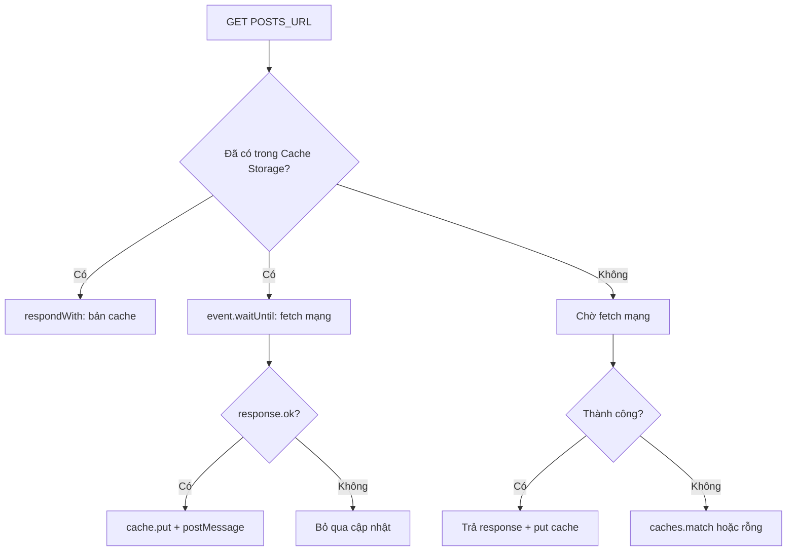

# Ví dụ nâng cao — stale-while-revalidate

Thư mục **`advanced/`** đăng ký Service Worker **riêng** (`scope` = chính thư mục đó) để không đè bản demo `sw.js` ở thư mục cha.

| File | Nội dung |
|------|----------|
| `advanced/index.html` | Trang demo + link về bản cơ bản |
| `advanced/app.js` | Đăng ký `./sw.js`, `fetch` posts, lắng `message` khi có bản mới nền |
| `advanced/sw.js` | SWR + dọn cache phiên bản cũ + `postMessage` sau khi mạng trả OK |

**Tên cache:** `125-offline-advanced-v2` (prefix `125-offline-advanced-`). Khi đổi version, trong `activate` chỉ xóa các key cùng prefix khác version — **không** xóa `posts-v1` của demo cơ bản.

---

## So với bản cơ bản

| | Cơ bản (`sw.js` gốc) | Nâng cao (`advanced/sw.js`) |
|---|----------------------|-----------------------------|
| Chiến lược | Network-first: luôn chờ mạng trước; lỗi mới đọc cache | **SWR:** có cache → trả **ngay**; mạng chạy **song song** cập nhật cache |
| Cảm nhận UX | Offline vẫn OK; online luôn chờ round-trip | Lần sau vào trang: hiện cache **tức thì**, có thể tinh chỉnh “đang cập nhật…” |
| Thông báo trang | Không | `POSTS_REFRESHED` sau khi fetch nền thành công |
| Dọn cache | Không | `activate`: xóa bản `125-offline-advanced-*` cũ |

---

## Luồng stale-while-revalidate



- **Có cache:** trình duyệt nhận response cache ngay → paint nhanh. Đồng thời `waitUntil` chạy `fetch` nền; thành công thì ghi đè cache và báo trang.
- **Không cache:** hành vi gần giống bản cơ bản (chờ mạng; thất bại thì thử cache hoặc `[]`).

---

## Giao tiếp `postMessage`

Sau khi fetch nền thành công, SW gửi:

```js
{ type: "POSTS_REFRESHED", url: POSTS_URL, ts: Date.now() }
```

Trang **không** `fetch` lại khi nhận tin nhắn — `fetch` sẽ đi qua SW, kích hoạt fetch nền và `POSTS_REFRESHED` tiếp → **vòng lặp**. Thay vào đó dùng `caches.match(POSTS_URL)` để đọc bản vừa ghi trong Cache Storage và cập nhật UI.

---

## Cách chạy

Mở qua HTTP (ví dụ XAMPP):

`http://localhost/125_offline_cache/advanced/`

Lần đầu cần mạng để tạo cache. Sau đó bật **Offline** trong DevTools: trang vẫn lấy được bản cache (từ nhánh “không cache lần đầu” đã lưu trước đó).

---

## Hướng mở rộng thực tế

- Thêm **header** hoặc **ETag** để quyết định có cần ghi đè cache hay không.
- **Phân tách** shell (`index.html`, JS, CSS) vào precache (Workbox) và API vào runtime cache giống đây.
- **IndexedDB** cho dữ liệu lớn / truy vấn phía client; Cache Storage giữ response HTTP thô.
- **Periodic Background Sync** / **Background Fetch** (hỗ trợ trình duyệt + policy) cho đồng bộ định kỳ.
