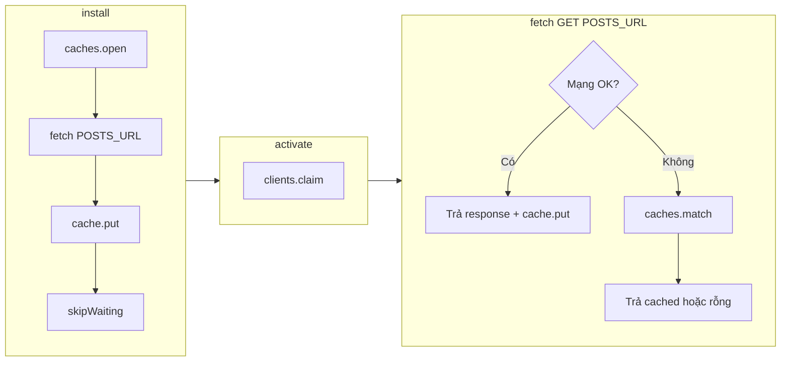
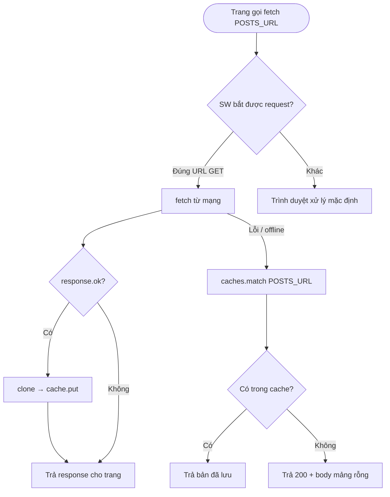
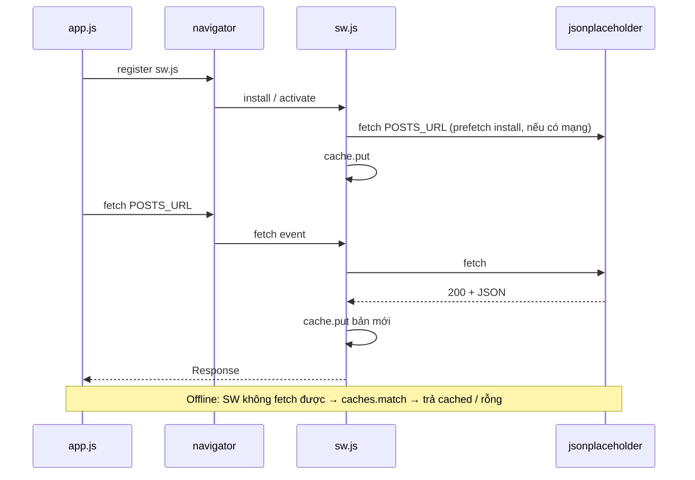

# Luồng cache — API posts offline

Tài liệu mô tả cách **Service Worker** (`sw.js`) và **trang** (`app.js`) phối hợp để gọi `https://jsonplaceholder.typicode.com/posts`, ưu tiên mạng, và dùng **Cache Storage** khi không có mạng.

## Thành phần

| File | Vai trò |
|------|---------|
| `index.html` | UI, load `app.js` |
| `app.js` | Đăng ký SW, `fetch` URL posts, parse JSON, render |
| `sw.js` | `install` prefetch + `fetch` handler: network-first, fallback cache |

**Tên cache:** `posts-v1`  
**URL được SW xử lý:** chỉ `GET` đúng `POSTS_URL` (các request khác không qua `respondWith`).

---

## Vòng đời Service Worker



- **install:** cố gắng tải posts một lần và ghi vào cache (warm cache). Lỗi mạng vẫn `skipWaiting()` để không kẹt.
- **activate:** `claim()` để SW điều khiển tab hiện tại sớm.
- **fetch:** chỉ áp dụng chiến lược dưới đây cho đúng URL/method.

---

## Chiến lược: network-first + fallback cache



- **Online, thành công:** response về trang ngay; ghi cache chạy song song (không chặn trả response).
- **Offline / lỗi mạng:** đọc cache; nếu chưa từng lưu → `[]` để `res.json()` không vỡ.

---

## Luồng từ lúc mở trang



---

## Ghi chú vận hành

1. **HTTPS hoặc localhost:** Service Worker không chạy trên `file://` và cần ngữ cảnh bảo mật phù hợp.
2. **Lần đầu chưa có cache:** cần ít nhất một lần có mạng (install và/hoặc fetch thành công) để offline có dữ liệu.
3. **Đổi tên cache** (ví dụ `posts-v2`) khi muốn “bỏ” dữ liệu cũ hoặc tránh dùng bản stale quá lâu — có thể bổ sung bước xóa `posts-v1` trong `activate`.

---

## Sơ đồ tóm tắt (một nhìn)

```
[install]     prefetch POSTS_URL → Cache Storage (posts-v1)
                 ↓
[activate]    clients.claim()
                 ↓
[fetch GET]   mạng OK  → trả response + cập nhật cache
              mạng FAIL → cache hit → trả cached
                         cache miss → trả []
```
