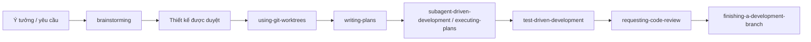

# Superpowers trên Cursor — cài đặt & ví dụ dùng

Repo gốc: [obra/superpowers](https://github.com/obra/superpowers)  
Bản clone local: `E:\xampp_htdocs_v5\134_superpower\Cursor`

## 1. Đã cài gì trong thư mục này?

Thư mục `Cursor/` là **bản clone đầy đủ** của Superpowers (skills, hooks, plugin manifest). Dùng để đọc tài liệu, học workflow, hoặc tham chiếu khi chỉnh skill.

Để **agent trong Cursor thực sự chạy** Superpowers, cần bật plugin trong IDE (bước 2). Clone local **không tự kích hoạt** skills nếu chưa cài plugin.

## 2. Kích hoạt plugin trong Cursor

### Cách khuyến nghị (marketplace)

1. Mở **Agent chat** trong Cursor.
2. Gõ:

   ```text
   /add-plugin superpowers
   ```

3. Hoặc mở **Plugin Marketplace**, tìm **Superpowers**, bấm Install.

Plugin sẽ load skills, hooks (`sessionStart`), và quy trình làm việc mặc định. Cập nhật thường qua marketplace (xem [RELEASE-NOTES.md](RELEASE-NOTES.md)).

### Thư mục clone local dùng để làm gì?

| Mục đích | Đường dẫn |
|----------|-----------|
| Đọc skill gốc | `skills/<tên-skill>/SKILL.md` |
| Cấu hình plugin Cursor | `.cursor-plugin/plugin.json` |
| Hook phiên làm việc | `hooks/hooks-cursor.json` |
| Cập nhật bản local | `git -C "E:\xampp_htdocs_v5\134_superpower\Cursor" pull` |

## 3. Superpowers hoạt động thế nào?

Agent **không nhảy vào code ngay**. Luồng chuẩn:



Nhiều skill **tự kích hoạt** khi ngữ cảnh phù hợp (mô tả trong `description` của từng `SKILL.md`). Bạn cũng có thể **gọi tường minh** trong chat.

Ưu tiên: **chỉ dẫn trực tiếp của bạn** (ví dụ `CLAUDE.md`, rule Cursor) > skill Superpowers > prompt mặc định.

## 4. Danh sách skill chính

| Skill | Khi nào dùng |
|-------|----------------|
| `brainstorming` | Trước mọi tính năng / thay đổi hành vi — làm rõ yêu cầu, thiết kế |
| `using-git-worktrees` | Sau khi duyệt thiết kế — workspace tách, baseline test sạch |
| `writing-plans` | Có spec — chia task 2–5 phút, đường dẫn file cụ thể |
| `executing-plans` | Có plan viết sẵn — thực thi theo batch + checkpoint |
| `subagent-driven-development` | Thực thi plan trong session — subagent + review 2 bước |
| `test-driven-development` | Trước code — RED → GREEN → REFACTOR |
| `systematic-debugging` | Bug, test fail, hành vi lạ — **chưa** sửa bừa |
| `verification-before-completion` | Trước khi nói “xong” / merge / PR |
| `requesting-code-review` | Xong task lớn — đối chiếu plan |
| `receiving-code-review` | Nhận feedback review — không sửa mù |
| `finishing-a-development-branch` | Xong hết — merge / PR / dọn worktree |
| `dispatching-parallel-agents` | Nhiều task độc lập song song |
| `using-superpowers` | Giới thiệu hệ skill (thường session đầu) |
| `writing-skills` | Tự viết skill mới theo chuẩn Superpowers |

## 5. Ví dụ prompt (copy vào Agent chat)

### A. Tính năng mới từ đầu

```text
Tôi muốn thêm API export CSV cho module đơn hàng trong folder 127_nodejs_revalidate_cache.
Hãy dùng quy trình Superpowers: brainstorm thiết kế trước, đừng viết code cho đến khi tôi duyệt spec.
```

**Kỳ vọng:** Agent hỏi từng bước, đề xuất 2–3 hướng, trình bày thiết kế theo section, lưu spec dạng `docs/superpowers/specs/YYYY-MM-DD-...-design.md`, rồi mới chuyển sang `writing-plans`.

### B. Đã có ý rõ — nhảy thẳng plan

```text
Spec đã chốt: endpoint GET /api/orders/export?format=csv, auth JWT, giới hạn 10k dòng.
Dùng skill writing-plans: lập plan từng task với đường dẫn file trong 127_nodejs_revalidate_cache.
```

### C. Thực thi plan (có checkpoint)

```text
Plan nằm ở docs/superpowers/plans/export-csv-plan.md.
Dùng executing-plans: làm batch 3 task đầu, dừng để tôi review trước khi tiếp.
```

### D. Thực thi nhanh với subagent

```text
Plan đã duyệt. Dùng subagent-driven-development: một subagent mỗi task,
review spec compliance rồi code quality trước khi sang task tiếp theo.
```

### E. TDD khi implement

```text
Implement task 2 trong plan: hàm buildCsvRows().
Bắt buộc test-driven-development: viết test fail trước, rồi code tối thiểu.
```

### F. Debug có hệ thống

```text
Test npm test 03-cache.test.js fail với "ENOTFOUND redis".
Dùng systematic-debugging: tìm root cause, chưa đề xuất fix cho đến khi có bằng chứng.
```

### G. Xác nhận trước khi báo xong

```text
Tôi nghĩ đã fix xong. Chạy verification-before-completion:
chạy lệnh test/lint thật và dán output trước khi kết luận.
```

### H. Code review nội bộ

```text
Xong các task trong plan export CSV.
Dùng requesting-code-review: so với plan và báo issue theo mức độ nghiêm trọng.
```

### I. Kết thúc nhánh / worktree

```text
Mọi test pass trên nhánh feature/export-csv.
Dùng finishing-a-development-branch: gợi ý merge, PR, giữ nhánh, hoặc hủy + dọn worktree.
```

### J. Nhiều việc song song

```text
Có 3 việc độc lập: (1) sửa README docker, (2) thêm script npm, (3) cập nhật .env.example.
Dùng dispatching-parallel-agents nếu có thể chạy song song.
```

### K. Worktree / Cursor `/worktree`

```text
Bắt đầu feature mới, tách khỏi workspace hiện tại.
Dùng using-git-worktrees (ưu tiên /worktree native của Cursor nếu có).
```

## 6. Mẹo dùng hiệu quả

1. **Nói rõ “đừng code trước khi duyệt”** nếu muốn ép `brainstorming` — skill có HARD-GATE nhưng câu của bạn giúp agent không vội.
2. **Trỏ đúng folder dự án** (`NNN_topic/`) vì repo này là nhiều mini-project độc lập (xem `CLAUDE.md` ở root).
3. **Gọi tên skill** khi muốn ép một bước cụ thể (`systematic-debugging`, `writing-plans`, …).
4. **Đọc skill gốc** khi agent làm khác kỳ vọng: mở `skills/<skill>/SKILL.md` trong thư mục clone.
5. **Cập nhật local:** `git pull` trong `134_superpower/Cursor`; plugin trên IDE cập nhật qua marketplace.

## 7. Liên kết

- README upstream: [README.md](README.md)
- Blog giới thiệu: [Superpowers release](https://blog.fsck.com/2025/10/09/superpowers/)
- Issues: https://github.com/obra/superpowers/issues
