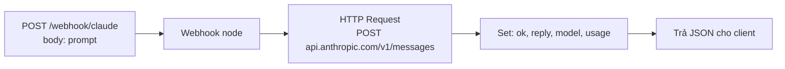

# n8n — ví dụ chạy từ Claude Code

Học **n8n** self-host trên Windows + Docker Desktop, import workflow gọi **Claude API** (Anthropic), trigger bằng PowerShell hoặc bash.

So với [`../Cursor/`](../Cursor/) (chỉ webhook → set node tĩnh), bản này thêm node **HTTP Request** gọi Claude và trả về câu trả lời do AI sinh.

## Cấu trúc

```
135_n8n/Claude/
├── docker-compose.yml
├── .env.example
├── .gitignore
├── workflows/
│   └── 01_webhook_claude.json   # Import vào n8n
└── scripts/
    ├── 01_trigger_webhook.ps1   # Windows
    └── 01_trigger_webhook.sh    # Git Bash / WSL
```

## Yêu cầu

- [Docker Desktop](https://www.docker.com/products/docker-desktop/) đang chạy
- Port **5678** chưa bị chiếm (nếu đang chạy `Cursor/` thì `docker compose down` trước)
- API key Anthropic: lấy ở https://console.anthropic.com/settings/keys

## Quick start

### 1. Cấu hình API key

```powershell
cd E:\xampp_htdocs_v5\135_n8n\Claude
copy .env.example .env
notepad .env   # dán ANTHROPIC_API_KEY=sk-ant-...
```

### 2. Khởi động n8n

```powershell
docker compose up -d
docker compose logs -f n8n
```

Mở editor: **http://localhost:5678**

Lần đầu: tạo tài khoản owner (lưu local trong volume Docker).

Kiểm tra key đã vào container:

```powershell
docker compose exec n8n printenv ANTHROPIC_API_KEY
```

### 3. Import workflow `01`

1. Trong n8n: **Workflows** → menu **⋯** → **Import from file**
2. Chọn `workflows/01_webhook_claude.json`
3. Mở workflow → bật **Active** (toggle góc trên phải)

Webhook production URL (sau khi active):

```text
POST http://localhost:5678/webhook/claude
```

### 4. Gọi thử webhook

**PowerShell** (từ thư mục `Claude/`):

```powershell
.\scripts\01_trigger_webhook.ps1
```

**curl** (Git Bash / WSL):

```bash
./scripts/01_trigger_webhook.sh
```

Kết quả mong đợi (JSON):

```json
{
  "ok": true,
  "reply": "n8n là nền tảng tự động hóa workflow mã nguồn mở...",
  "model": "claude-haiku-4-5-20251001",
  "usage": { "input_tokens": 25, "output_tokens": 78 }
}
```

### 5. Dừng stack

```powershell
docker compose down
```

Giữ data workflow: volume `n8n_data` (xóa hẳn bằng `docker compose down -v`).

---

## Workflow 01 — làm gì?



- Body request: `{ "prompt": "..." }` (mặc định nếu thiếu: "Xin chào, hãy tự giới thiệu trong 1 câu tiếng Việt.")
- Header `x-api-key` lấy từ `{{ $env.ANTHROPIC_API_KEY }}` (n8n đọc env biến của container)
- Body gửi Claude dùng `JSON.stringify($json.body.prompt)` để escape an toàn chuỗi tiếng Việt / ký tự đặc biệt
- Model: `claude-haiku-4-5-20251001` (rẻ + nhanh cho demo). Đổi sang Sonnet/Opus nếu cần chất lượng cao hơn.

---

## Dùng với Claude Code

Sau khi workflow **Active**, có thể nhờ Claude Code trong chat:

```text
Trong 135_n8n/Claude, chạy docker compose up -d, đợi n8n lên,
rồi POST http://localhost:5678/webhook/claude với body
{"prompt":"viết haiku về Hà Nội"} và cho tôi xem reply.
```

Claude sẽ chạy `docker compose up`, `Invoke-RestMethod` (PowerShell trên Windows), và báo nếu workflow chưa Active hoặc thiếu key.

---

## Bài tiếp theo (gợi ý)

| Workflow | Mô tả |
|----------|-------|
| `02_chain_prompts` | Webhook → Claude (sinh outline) → Claude (viết chi tiết) → return |
| `03_conditional` | Thêm node **If** check `prompt.length` để pick model (Haiku/Sonnet) |
| `04_persist` | Lưu Q&A vào file/DB (Postgres node) để có lịch sử |
| `05_schedule` | Schedule Trigger 1 ngày 1 lần → fetch RSS → Claude tóm tắt → mail |

---

## Lỗi thường gặp

| Triệu chứng | Nguyên nhân | Cách xử lý |
|-------------|-------------|------------|
| `404` trên `/webhook/claude` | Workflow chưa **Active** | Bật toggle Active, đợi vài giây |
| `401` từ HTTP Request node | Sai/thiếu `ANTHROPIC_API_KEY` | Check `.env`, `docker compose down && up -d` để reload |
| `connection refused` :5678 | Container chưa chạy | `docker compose up -d`, xem `docker compose ps` |
| `reply` rỗng / lỗi parse | Claude trả format khác (rate limit, content filter) | Xem **Executions** trong n8n, click node HTTP Request để xem raw response |
| Expression `$env.ANTHROPIC_API_KEY` empty | n8n chặn truy cập env | Verify `N8N_BLOCK_ENV_ACCESS_IN_NODE=false` trong compose |
| Tiếng Việt bị mojibake trong PowerShell | UTF-8 chưa bật | Dùng `ConvertTo-Json` với `-Encoding UTF8` hoặc dùng script `.sh` |

---

## Ghi chú production / chi phí

- Mỗi call Haiku 4.5 ~$0.001 cho prompt ngắn — đủ rẻ để demo nhưng đừng để webhook public không auth (ai cũng spam được).
- Lên server thật cần thêm: HTTPS, `WEBHOOK_URL` public, auth ở Webhook node (Header Auth), Postgres thay SQLite, backup volume.
- Key Anthropic **không bao giờ** commit vào git — đã có `.env` trong `.gitignore`.
- Xem thêm: [n8n Docker docs](https://docs.n8n.io/hosting/installation/docker/), [Anthropic Messages API](https://docs.anthropic.com/en/api/messages).
