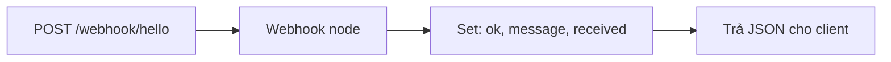

# n8n — ví dụ chạy từ Cursor

Học **n8n** self-host trên máy local (Windows + Docker Desktop), import workflow mẫu, gọi webhook bằng PowerShell hoặc Agent trong Cursor.

## Cấu trúc

```
135_n8n/Cursor/
├── docker-compose.yml
├── .env.example
├── workflows/
│   ├── README.md                # Mô tả từng workflow + use case IT
│   ├── 01_webhook_hello.json    # Smoke test (Webhook → Set)
│   ├── 02_health_check.json     # Uptime/health check (Schedule + Manual)
│   ├── 03_log_intake.json       # Log/incident intake (Webhook → Enrich → IF)
│   └── 04_ip_check.json         # IP reputation lookup (Webhook → HTTP → IF)
└── scripts/
    ├── 01_trigger_webhook.ps1 / .sh
    ├── 02_health_check.ps1 / .sh
    ├── 03_log_intake.ps1 / .sh
    └── 04_ip_check.ps1 / .sh
```

> Chi tiết từng workflow (mục đích IT, payload, mở rộng): [`workflows/README.md`](workflows/README.md)

## Yêu cầu

- [Docker Desktop](https://www.docker.com/products/docker-desktop/) đang chạy
- Port **5678** chưa bị chiếm

## Quick start

### 1. Khởi động n8n

```powershell
cd E:\xampp_htdocs_v5\135_n8n\Cursor
docker compose up -d
docker compose logs -f n8n
```

Mở editor: **http://localhost:5678**

Lần đầu: tạo tài khoản owner (lưu local trong volume Docker).

### 2. Import workflow `01`

1. Trong n8n: **Workflows** → menu **⋯** → **Import from file**
2. Chọn `workflows/01_webhook_hello.json`
3. Mở workflow → bật **Active** (toggle góc trên phải)

Webhook production URL (sau khi active):

```text
POST http://localhost:5678/webhook/hello
```

### 3. Gọi thử webhook

**PowerShell** (từ thư mục `Cursor/`):

```powershell
.\scripts\01_trigger_webhook.ps1
```

**curl** (Git Bash / WSL):

```bash
./scripts/01_trigger_webhook.sh
```

Kết quả mong đợi (JSON):

```json
{
  "ok": true,
  "message": "Xin chào, Hiếu! (n8n demo 135)",
  "received": { "name": "Hiếu" }
}
```

### 4. Dừng stack

```powershell
docker compose down
```

Giữ data workflow: volume `n8n_data` (xóa hẳn bằng `docker compose down -v`).

---

## Dùng với Cursor Agent

Sau khi workflow **Active**, có thể nhờ Agent trong chat:

```text
Chạy docker compose trong 135_n8n/Cursor, đợi n8n lên, rồi POST http://localhost:5678/webhook/hello
với body {"name":"Cursor"} và cho tôi xem response.
```

Agent sẽ `docker compose up`, `curl`/`Invoke-RestMethod`, và báo lỗi nếu workflow chưa bật.

---

## Workflow 01 — làm gì?



- Nhận JSON body (ví dụ `{ "name": "Hiếu" }`)
- Trả lời có `message` chào theo `name`, kèm `received` echo body

---

## Workflow 02 / 03 / 04 — ứng dụng IT

Đã có sẵn 3 workflow import-ready trong `workflows/` cho các tác vụ IT thường gặp: health-check service, intake log/incident, kiểm tra reputation IP. Xem [`workflows/README.md`](workflows/README.md) cho payload, diagram và cách test.

---

## Lỗi thường gặp

| Triệu chứng | Nguyên nhân | Cách xử lý |
|-------------|-------------|------------|
| `404` trên `/webhook/hello` | Workflow chưa **Active** | Bật toggle Active, đợi vài giây |
| `connection refused` :5678 | Container chưa chạy | `docker compose up -d`, xem `docker compose ps` |
| Import lỗi node version | n8n image quá cũ/mới | `docker compose pull` rồi `up -d` lại |
| Cookie / đăng nhập lạ trên localhost | HTTPS vs HTTP | Giữ `N8N_SECURE_COOKIE=false` trong compose (đã có) |

---

## Ghi chú production

Demo này **chỉ cho local**: HTTP, không reverse proxy, SQLite trong container.

Lên server thật cần thêm: HTTPS, `WEBHOOK_URL` public, Postgres (hoặc DB managed), backup volume, và tắt/basic auth hoặc SSO — xem [n8n Docker docs](https://docs.n8n.io/hosting/installation/docker/).
