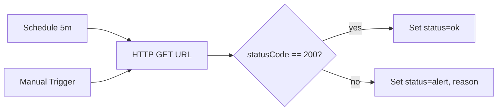
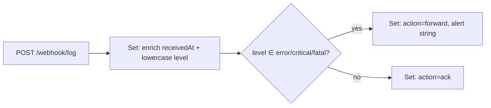

# Workflows — danh sách & cách dùng

Tất cả workflow trong folder này import vào n8n bằng **Workflows → ⋯ → Import from file**, sau đó bật toggle **Active** (trừ workflow chạy bằng Manual Trigger).

| # | File | Trigger | Mục đích IT |
|---|------|---------|-------------|
| 01 | [`01_webhook_hello.json`](01_webhook_hello.json) | Webhook `POST /webhook/hello` | Smoke-test n8n + webhook → set node |
| 02 | [`02_health_check.json`](02_health_check.json) | Schedule (5m) + Manual | Uptime/health-check một URL, route OK vs ALERT |
| 03 | [`03_log_intake.json`](03_log_intake.json) | Webhook `POST /webhook/log` | Mini log collector — enrich + route theo severity |
| 04 | [`04_ip_check.json`](04_ip_check.json) | Webhook `POST /webhook/ip-check` | IP reputation lookup qua `ip-api.com`, verdict clean/suspicious |

> Tất cả webhook đều phục vụ trên `http://localhost:5678/webhook/<path>` sau khi workflow đã **Active**. Khi chưa active hoặc đang chỉnh sửa, n8n cấp URL test (`/webhook-test/...`) hiển thị trong node Webhook.

---

## 02 — Health Check & Alert



**Use case IT:** ping một service/URL định kỳ, branch ALERT là chỗ để gắn thêm node gửi Slack/Telegram/Email sau này.

**Cấu hình nhanh:**
- Mở node **Probe URL** → đổi `url` thành endpoint cần monitor.
- HTTP node bật `neverError = true` + `fullResponse = true` để code khác 2xx không kill execution, vẫn xuống nhánh ALERT.
- Schedule 5 phút; lúc dev dùng **Manual Trigger** (Execute Workflow) để khỏi đợi.

**Test:**
```powershell
# Probe URL thử tay (không gọi n8n) – tiện đối chiếu với output workflow
.\scripts\02_health_check.ps1
```
```bash
./scripts/02_health_check.sh https://example.com
```

---

## 03 — Log / Incident Intake



**Use case IT:** app/service POST log JSON về n8n; severe thì forward sang kênh alert, còn lại chỉ ack — đơn giản hơn dựng Fluent Bit/Logstash khi chỉ cần demo hoặc tiền xử lý.

**Payload mẫu (request):**
```json
{ "service": "api-gateway", "level": "error", "msg": "Upstream 502 from auth-svc" }
```

**Response (nhánh forward):**
```json
{
  "action": "forward",
  "alert": "[ERROR] api-gateway — Upstream 502 from auth-svc",
  "service": "api-gateway",
  "level": "error",
  "receivedAt": "2026-05-24T03:21:08.123Z"
}
```

**Test:**
```powershell
.\scripts\03_log_intake.ps1 -Level error
.\scripts\03_log_intake.ps1 -Level info -Msg "user X logged in"
```
```bash
./scripts/03_log_intake.sh api-gateway error "Upstream 502"
./scripts/03_log_intake.sh api-gateway info  "user X logged in"
```

**Mở rộng:** thay nhánh `Forward` bằng node Slack / Telegram / SMTP. Hoặc thêm Postgres node để ghi log vào DB.

---

## 04 — IP Reputation Check

```mermaid
flowchart LR
  W[POST /webhook/ip-check] --> L[HTTP GET ip-api.com/json/{ip}]
  L --> C{status==success && !proxy && !hosting?}
  C -- yes --> CL[Set: verdict=clean, country, isp]
  C -- no  --> SU[Set: verdict=suspicious, reasons]
```

**Use case IT:** ops cần biết một IP có thuộc dải proxy/hosting/datacenter không trước khi mở firewall hoặc whitelist. `ip-api.com` free, không cần API key, 45 req/phút từ một IP nguồn.

**Payload mẫu:**
```json
{ "ip": "8.8.8.8" }
```

**Response clean:**
```json
{ "ip": "8.8.8.8", "verdict": "clean", "country": "United States", "isp": "Google LLC" }
```

**Response suspicious:**
```json
{
  "ip": "104.21.10.10",
  "verdict": "suspicious",
  "reasons": ["hosting"],
  "country": "United States",
  "isp": "Cloudflare, Inc."
}
```

**Test:**
```powershell
.\scripts\04_ip_check.ps1 -Ip 8.8.8.8
.\scripts\04_ip_check.ps1 -Ip 104.21.10.10
```
```bash
./scripts/04_ip_check.sh 8.8.8.8
./scripts/04_ip_check.sh 104.21.10.10
```

**Mở rộng:** swap `ip-api.com` sang AbuseIPDB / VirusTotal nếu cần điểm uy tín chi tiết hơn (cần API key — dùng node **Credentials** trong n8n).

---

## Tổng kết các pattern n8n đã học qua 4 workflow

| Pattern | Workflow |
|---------|----------|
| Webhook → Set tĩnh | 01 |
| Schedule + Manual cùng vào 1 node (multi-trigger) | 02 |
| HTTP Request với `neverError + fullResponse` | 02 |
| IF node 2 nhánh + Set khác nhau cho từng nhánh | 02, 03, 04 |
| Webhook nhận body JSON + chuẩn hoá field | 03, 04 |
| Webhook responseMode `lastNode` — trả output của nhánh hiện tại | 01, 03, 04 |
| HTTP Request gọi API ngoài + dùng kết quả cho IF | 04 |

Bước tiếp theo gợi ý: thêm credential (Slack/Telegram/SMTP) và nối node gửi thông báo vào nhánh ALERT / Forward / Suspicious.
